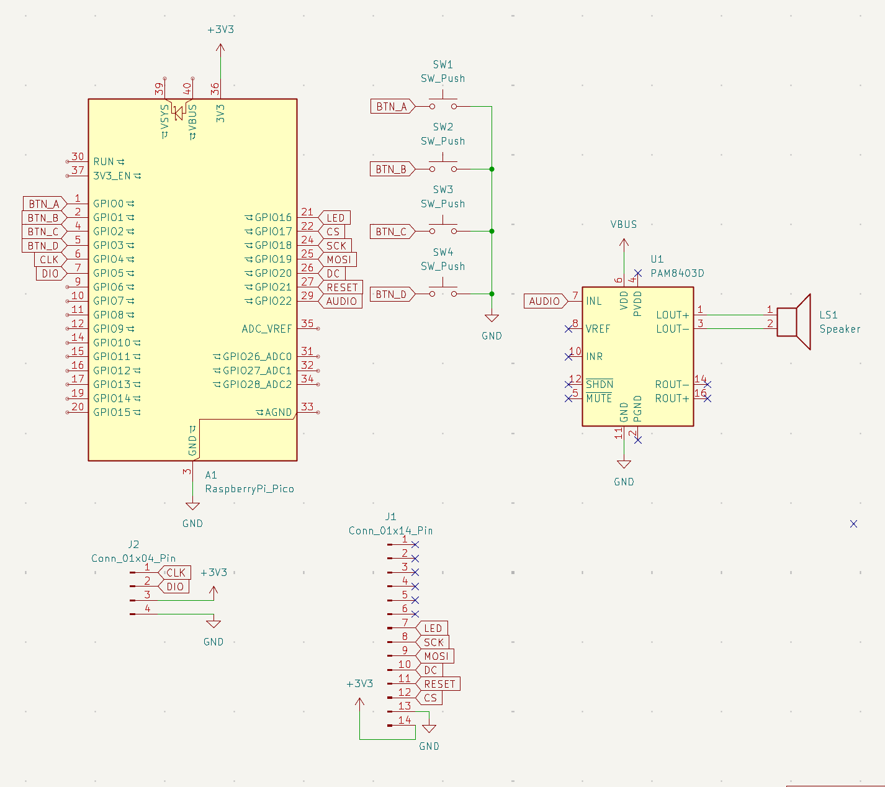

# Keystroke

_A mini piano-based arcade game, based off the arcade game Grand Piano Keys_

by [@crkalapat](https://github.com/crkalapat), [@hephaestushex](https://github.com/hephaestushex) and [@ceansounet](https://github.com/ceansounet)

_Demo placeholder here_

## How to Play

On bootup, Keystroke will show the title screen, and the current high score. Hit any one of
the four piano keys at the bottom, and gameplay will start immediately along with a 30 second timer.

On screen, there will be colored rectangles that correspond to a key that you must physically
press on the arcade cabinet. Hitting the correct key will cause the next key to fall down for you to
hit. Hitting the wrong key will cause a brief waiting penalty, indicating by the flashing wrong key,
but you can continue playing (if there's time left) after the penalty.

Once 30 seconds ends (as indicated by the 4 digit 7 segment display), the game will be over. You can
view your score, and you will also be notified if you beat the high score, which is stored in flash
memory.

## Features

- 4 Cherry MX Compatible Key Switches
- 2.8" TFT LCD Display (ST7789)
- 30 mm Speaker with PAM8403 amp
- 4 Digit 7 Segment Display (TM1637)
- Orpheus Pico v2 MCU

## Firmware

Keystroke uses PlatformIO, with earlephilhower's build.

## Schematic

## CAD

You can view the full assembled cabinet as a STEP file under the `cad/` subdirectory, or [view the CAD on OnShape.](https://cad.onshape.com/documents/00226f2798e720e0cd69b425/w/7683bf336800655d27df2c58/e/37cc4361323e3d3f5d8912c6)
